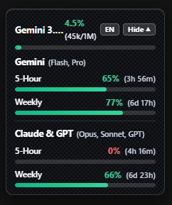

# Antigravity Tokens HUD (Carbon Edition)

<p align="center">
  
</p>

<p align="center">
  <b>High-contrast matte carbon HUD for Google Antigravity 2.0.</b>
  <br />
  <a href="README.ru.md">🇷🇺 Русский</a> • <a href="README.md">🇬🇧 English</a>
</p>

---

## ✨ Features

- **Matte Carbon UI**: Deep matte carbon fiber texture (`#0c0d10`), smooth progress bars, pure high-contrast white text, zero emojis.
- **Dual Quota Display**: Simultaneous view of 5-hour and weekly limits with reset timers for both:
  - **Gemini** (Flash, Pro)
  - **Claude & GPT** (Opus, Sonnet, GPT)
- **Collapse & Toggle Controls**:
  - **Hide ▲ / Open ▼**: Instantly collapse the widget into a single slim row.
  - **RU / EN**: 1-click language toggle.
- **Auto-Refresh**: Live quota sync every 30 seconds prevents stale stats.
- **Zero Lag**: In-memory SQLite parser running directly inside Node.js (instant ~4ms reads).
- **Persistent Autostart**: Starts automatically with Antigravity and on Windows startup; single-instance lock prevents duplicate processes.

---

## 🚀 Quick Install

### Windows (PowerShell)
```powershell
irm https://raw.githubusercontent.com/quazovsky/antigravity-tokens-hud/main/install.ps1 | iex
```

### macOS / Linux
```bash
curl -fsSL https://raw.githubusercontent.com/quazovsky/antigravity-tokens-hud/main/install.sh | bash
```

---

## 🗑️ Uninstall

- **Windows:** `powershell -ExecutionPolicy Bypass -File "$env:USERPROFILE\.antigravity-tokens-hud\uninstall.ps1"`
- **macOS / Linux:** `~/.antigravity-tokens-hud/uninstall.sh`

---

## 📄 License
MIT © [quazovsky](https://github.com/quazovsky) / [myslithell](https://github.com/myslithell)
