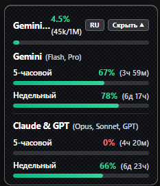

# Antigravity Tokens HUD (Carbon Edition)

<p align="center">
  
</p>

<p align="center">
  <b>Минималистичный высококонтрастный карбоновый HUD контекста и квот для Google Antigravity 2.0.</b>
  <br />
  <a href="README.ru.md">🇷🇺 Русский</a> • <a href="README.md">🇬🇧 English</a>
</p>

---

## ✨ Особенности

- **Матовый карбоновый дизайн**: Тёмная карбоновая текстура (`#0c0d10`), плавные градиентные полосы и контрастный белый текст высокой читаемости без лишних смайликов.
- **Все лимиты на одном экране**:
  - **Gemini** (Flash, Pro) — 5-часовой и недельный лимит с обратным отсчетом.
  - **Claude & GPT** (Opus, Sonnet, GPT) — 5-часовой и недельный лимит.
- **Удобное управление**:
  - **«Скрыть ▲» / «Открыть ▼»** — моментальное сворачивание виджета в одну аккуратную строку.
  - **«RU / EN»** — быстрое переключение языка в 1 клик.
- **Всегда актуальные данные**: Официальные квоты обновляются автоматически каждые 30 секунд.
- **Мгновенная работа**: Встроенный SQLite-парсер прямо в Node.js без задержек.
- **Умный автозапуск**: Бесшовный запуск вместе с Antigravity, автозагрузка Windows и защита от повторных копий (Single-Instance Lock).

---

## 🚀 Быстрая установка

### Windows (PowerShell)
```powershell
irm https://raw.githubusercontent.com/quazovsky/antigravity-tokens-hud/main/install-ru.ps1 | iex
```

### macOS / Linux
```bash
curl -fsSL https://raw.githubusercontent.com/quazovsky/antigravity-tokens-hud/main/install-ru.sh | bash
```

---

## 🗑️ Удаление

- **Windows:** `powershell -ExecutionPolicy Bypass -File "$env:USERPROFILE\.antigravity-tokens-hud\uninstall.ps1"`
- **macOS / Linux:** `~/.antigravity-tokens-hud/uninstall.sh`

---

## 📄 Лицензия
MIT © [quazovsky](https://github.com/quazovsky) / [myslithell](https://github.com/myslithell)
